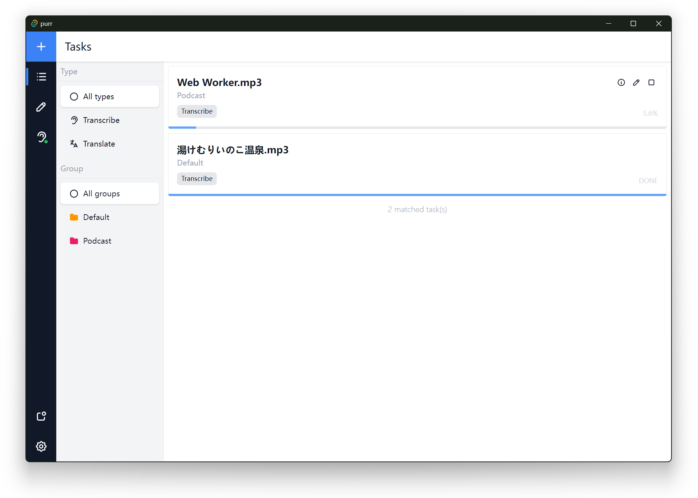
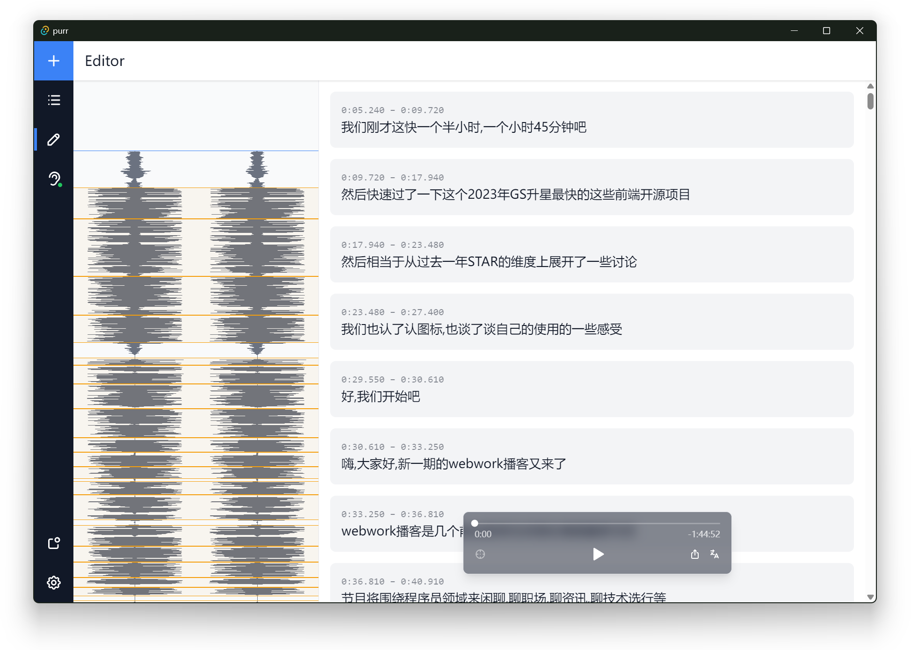
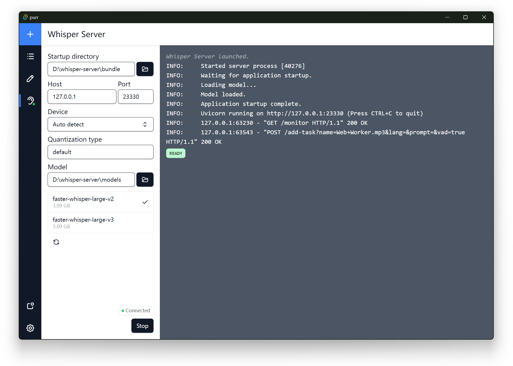

# purr

An all-in-one tool for speech-to-text transcription, subtitle editing & translation.

> [!WARNING]  
> The application is under heavy development. There may be breaking changes in the future.

Related project: [whisper-server](https://github.com/Zhousiru/whisper-server)

## Screenshots

## TODOs

- [ ] Select task on the editor page
- [ ] Adjust subtitle start and end times
- [ ] Export subtitles
- [ ] Process translation tasks
